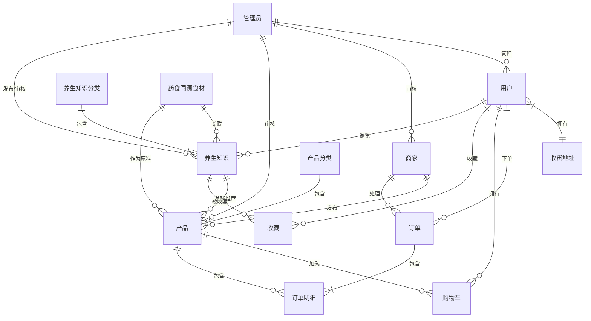

```mermaid
erDiagram
 

    用户 }|--|| 收货地址 : "拥有"
    用户 ||--o{ 订单 : "下单"
    用户 ||--o{ 购物车 : "拥有"
    用户 ||--o{ 收藏 : "收藏"
    用户 ||--o{ 养生知识 : "浏览"

    管理员 ||--o{ 用户 : "管理"
    管理员 ||--o{ 商家 : "审核"
    管理员 ||--o{ 产品 : "审核"
    管理员 ||--o{ 养生知识 : "发布/审核"

    商家 ||--o{ 产品 : "发布"
    商家 ||--o{ 订单 : "处理"

    产品分类 ||--|{ 产品 : "包含"
    产品 ||--o{ 购物车 : "加入"
    产品 ||--o{ 订单明细 : "包含"

    订单 ||--|{ 订单明细 : "包含"

    养生知识分类 ||--|{ 养生知识 : "包含"
    养生知识 ||--o{ 产品 : "关联推荐"
    养生知识 ||--o{ 收藏 : "被收藏"

    药食同源食材 ||--o{ 养生知识 : "关联"
    药食同源食材 ||--o{ 产品 : "作为原料"

            
```