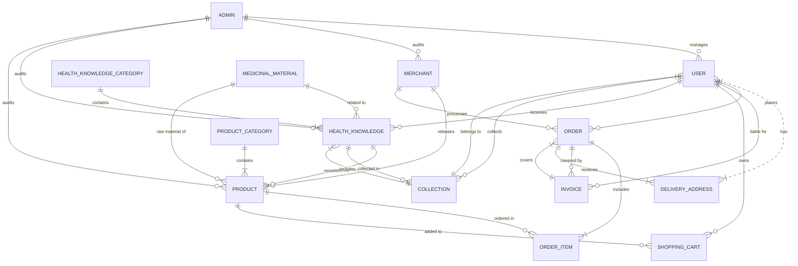

```mermaid
erDiagram
    USER }|..|{ DELIVERY_ADDRESS : "has"
    USER ||--o{ ORDER : "places"
    USER ||--o{ INVOICE : "liable for"
    USER ||--o{ SHOPPING_CART : "owns"
    USER ||--o{ HEALTH_KNOWLEDGE : "browses"
    USER ||--o{ COLLECTION : "collects"

    ADMIN ||--o{ USER : "manages"
    ADMIN ||--o{ MERCHANT : "audits"
    ADMIN ||--o{ HEALTH_KNOWLEDGE : "audits"
    ADMIN ||--o{ PRODUCT : "audits"

    MERCHANT ||--o{ PRODUCT : "releases"
    MERCHANT ||--o{ ORDER : "processes"

    PRODUCT_CATEGORY ||--|{ PRODUCT : "contains"
    PRODUCT ||--o{ ORDER_ITEM : "ordered in"
    PRODUCT ||--o{ SHOPPING_CART : "added to"

    ORDER ||--|{ ORDER_ITEM : "includes"
    ORDER ||--o{ INVOICE : "covered by"
    ORDER ||--|{ DELIVERY_ADDRESS : "receives"

    INVOICE ||--|{ ORDER : "covers"

    HEALTH_KNOWLEDGE_CATEGORY ||--|{ HEALTH_KNOWLEDGE : "contains"
    HEALTH_KNOWLEDGE ||--o{ PRODUCT : "recommends"
    HEALTH_KNOWLEDGE ||--o{ COLLECTION : "collected in"

    MEDICINAL_MATERIAL ||--o{ HEALTH_KNOWLEDGE : "related to"
    MEDICINAL_MATERIAL ||--o{ PRODUCT : "raw material of"

    COLLECTION ||--|{ USER : "belongs to"
    COLLECTION ||--|{ HEALTH_KNOWLEDGE : "includes"
```