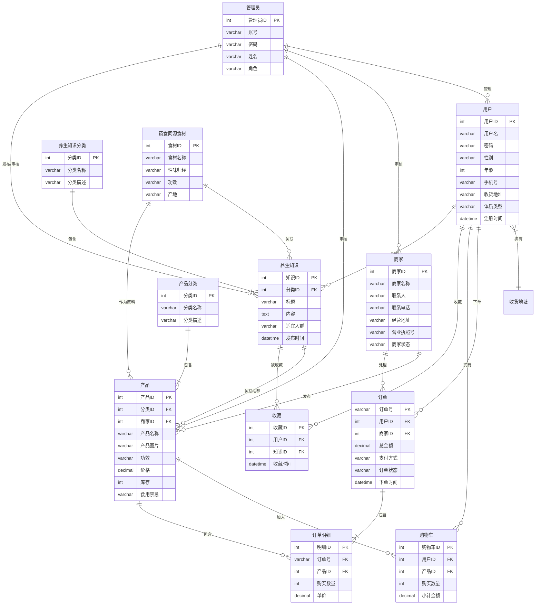

```mermaid
erDiagram
    用户 {
        int 用户ID PK
        varchar 用户名
        varchar 密码
        varchar 性别
        int 年龄
        varchar 手机号
        varchar 收货地址
        varchar 体质类型
        datetime 注册时间
    }
    管理员 {
        int 管理员ID PK
        varchar 账号
        varchar 密码
        varchar 姓名
        varchar 角色
    }
    商家 {
        int 商家ID PK
        varchar 商家名称
        varchar 联系人
        varchar 联系电话
        varchar 经营地址
        varchar 营业执照号
        varchar 商家状态
    }
    产品分类 {
        int 分类ID PK
        varchar 分类名称
        varchar 分类描述
    }
    产品 {
        int 产品ID PK
        int 分类ID FK
        int 商家ID FK
        varchar 产品名称
        varchar 产品图片
        varchar 功效
        decimal 价格
        int 库存
        varchar 食用禁忌
    }
    养生知识分类 {
        int 分类ID PK
        varchar 分类名称
        varchar 分类描述
    }
    养生知识 {
        int 知识ID PK
        int 分类ID FK
        varchar 标题
        text 内容
        varchar 适宜人群
        datetime 发布时间
    }
    药食同源食材 {
        int 食材ID PK
        varchar 食材名称
        varchar 性味归经
        varchar 功效
        varchar 产地
    }
    购物车 {
        int 购物车ID PK
        int 用户ID FK
        int 产品ID FK
        int 购买数量
        decimal 小计金额
    }
    订单 {
        varchar 订单号 PK
        int 用户ID FK
        int 商家ID FK
        decimal 总金额
        varchar 支付方式
        varchar 订单状态
        datetime 下单时间
    }
    订单明细 {
        int 明细ID PK
        varchar 订单号 FK
        int 产品ID FK
        int 购买数量
        decimal 单价
    }
    收藏 {
        int 收藏ID PK
        int 用户ID FK
        int 知识ID FK
        datetime 收藏时间
    }

    用户 }|--|| 收货地址 : "拥有"
    用户 ||--o{ 订单 : "下单"
    用户 ||--o{ 购物车 : "拥有"
    用户 ||--o{ 收藏 : "收藏"
    用户 ||--o{ 养生知识 : "浏览"

    管理员 ||--o{ 用户 : "管理"
    管理员 ||--o{ 商家 : "审核"
    管理员 ||--o{ 产品 : "审核"
    管理员 ||--o{ 养生知识 : "发布/审核"

    商家 ||--o{ 产品 : "发布"
    商家 ||--o{ 订单 : "处理"

    产品分类 ||--|{ 产品 : "包含"
    产品 ||--o{ 购物车 : "加入"
    产品 ||--o{ 订单明细 : "包含"

    订单 ||--|{ 订单明细 : "包含"

    养生知识分类 ||--|{ 养生知识 : "包含"
    养生知识 ||--o{ 产品 : "关联推荐"
    养生知识 ||--o{ 收藏 : "被收藏"

    药食同源食材 ||--o{ 养生知识 : "关联"
    药食同源食材 ||--o{ 产品 : "作为原料"

            
```